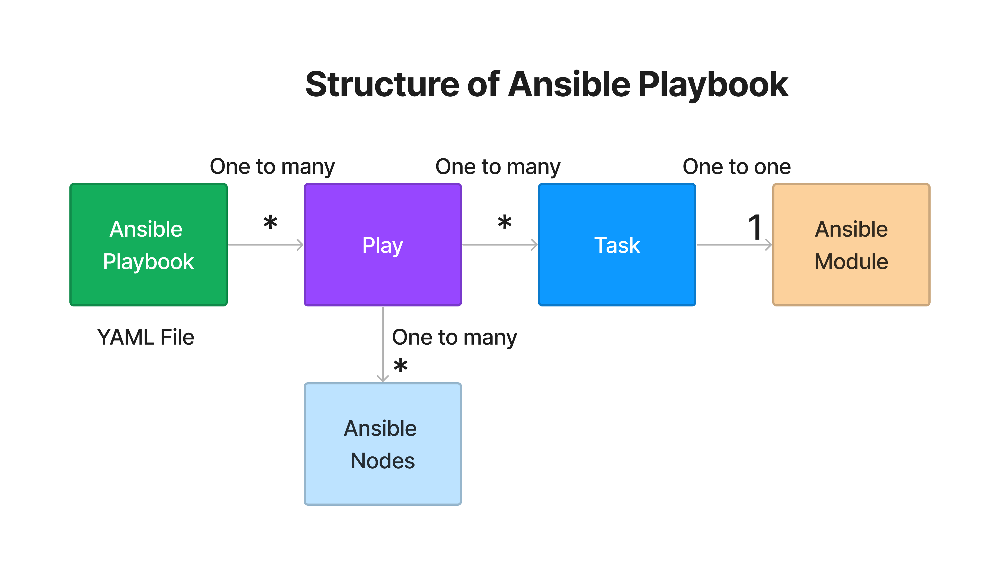

# Day 1

## Info - Dual/multi booting  - dynamic inventory ( python script )

<pre>
- let's say you already have windows OS installed on your laptop, for R&D purpose you need some Linux OS
- you could use Boot Loader utilities like LILO(deprecated/outdated), GRUB, BootCamp(Mac)
- Master Boot Record(MBR - Hard Disk - Byte 0 Sector 0) - 512 bytes
  - Boot Loader software is installed in the MBR 
- When we power on a machine, BIOS will perform POST (Power On Self Test)
  - BIOS will instruct the CPU to launch the Boot Loader software residing in MBRFROM ubuntu:16.04
MAINTAINER Jeganathan Swaminathan <jegan@tektutor.org>
Already up to date.

RUN apt-get update && apt-get install -y openssh-server python3
RUN mkdir /var/run/sshd
RUN echo 'root:root' | chpasswd
RUN sed -i 's/PermitRootLogin prohibit-password/PermitRootLogin yes/' /etc/ssh/sshd_config

# SSH login fix. Otherwise user is kicked off after login
RUN sed 's@session\s*required\s*pam_loginuid.so@session optional pam_loginuid.so@g' -i /etc/pam.d/sshd

RUN mkdir -p /root/.ssh
COPY authorized_keys /root/.ssh/authorized_keys

EXPOSE 22
EXPOSE 80 
CMD ["/usr/sbin/sshd", "-D"]FROM ubuntu:16.04
MAINTAINER Jeganathan Swaminathan <jegan@tektutor.org>

RUN apt-get update && apt-get install -y openssh-server python3
RUN mkdir /var/run/sshd
RUN echo 'root:root' | chpasswd
RUN sed -i 's/PermitRootLogin prohibit-password/PermitRootLogin yes/' /etc/ssh/sshd_config

# SSH login fix. Otherwise user is kicked off after login
RUN sed 's@session\s*required\s*pam_loginuid.so@session optional pam_loginuid.so@g' -i /etc/pam.d/sshd

RUN mkdir -p /root/.ssh
COPY authorized_keys /root/.ssh/authorized_keys

EXPOSE 22
EXPOSE 80 
CMD ["/usr/sbin/sshd", "-D"]FROM ubuntu:16.04
MAINTAINER Jeganathan Swaminathan <jegan@tektutor.org>

RUN apt-get update && apt-get install -y openssh-server python3
RUN mkdir /var/run/sshd
RUN echo 'root:root' | chpasswd
RUN sed -i 's/PermitRootLogin prohibit-password/PermitRootLogin yes/' /etc/ssh/sshd_config

# SSH login fix. Otherwise user is kicked off after login
RUN sed 's@session\s*required\s*pam_loginuid.so@session optional pam_loginuid.so@g' -i /etc/pam.d/sshd

RUN mkdir -p /root/.ssh
COPY authorized_keys /root/.ssh/authorized_keys

EXPOSE 22
EXPOSE 80 
CMD ["/usr/sbin/sshd", "-D"]
  - Boot Loader then scans all your hard disks looking for Operating Systems, if it finds more than one OS, it gives a menu for you to choose between those OS
- though more than one OS is installed on your system, only one can be actively running at any point of time
</pre>  

## Info - Hypervisor Overview
<pre>
- a virtualization technology
- running more than one Operating System on the same machine ( laptop/desktop/workstation/server )
- more than one OS can actively running
- examples
  - Type 1 ( is used in workstations/servers )
    - VMWare vSphere/Vcenter
    - KVM ( Opensource )
  - Type 2 ( are used in desktops/laptops/workstations )
    - Oracle Virtualbox ( Free )
    - Parallels (Mac OS-X)
    - VMWare Fusion(Mac OS-X)
    - VMWare Workstation ( Windows & Linux )
    - Microsoft Hyper-V  - dynamic inventory ( python script )

- this type of virtualization is called heavy-weight
  - for each Virtual Machine(VM) we need to allocated dedicated hardware resources
    - CPU Cores
    - RAM
    - Storage ( HDD/SSD )
- Hyperthreading
  - each physical cpu core can support two logical(virtual) core
  - i.e if you have a machine with 4 Cores, we have total 4x2 = 8 virtual cores
- the max number of VMs that can be supported by a machine is based on
  - how many virtual cores your machine has ( Primary factor )
  - how much RAM your machine has
  - how much storage your machine has
- each VM represents one Operating System
</pre>

## Info - Containerization
<pre>
- light-weight application virtualization technology
- all containers running on the same OS(machine) they share the hardware resources on the underlying os
- each container represents on one application
- containers are not OS
- containers will never be able to replace OS/VM
- containers don't have their own OS Kernel
- similarities between containers and virtual machines(OS)
  - just like each VM get's it own IP address, each container gets its own IP address 
  - just like each VM has its own Network card, each container has its own network card
  - just like each VM has its own file system, each container has its own file system
  - just like each VM has its own port range, each container has its own port range 0-65535 ports
- examples
  - Docker, Podman, containerd, etc
</pre>
Commands
## Info - Container Engine
<pre>
- is a high-level software that helps managing container images and containers
- is very user-friendly
- container engines internally depends on Container Runtimes to manage images and containers
- examples
  - Docker Container Engine depends on containerd which in turn depends on runC container runtime
  - Podman Container Engine depends on CRI-O container runtime
</pre>  

## Info - Container Runtime
<pre>
- is a low-level software that helps managing container images and containers
- is not so user-friendly, hence normally no end-user use this
- examples
  - runC is a container runtime
  - CRI-O is a container runtime
</pre>

## Linux Distributions
<pre>
- Ubuntu Linux Distribution
- Fedora Linux Distribution
- Red Hat Enterprise Linux Distribution

</pre>  

## Info - Configuration Management
<pre>
- helps in automating all the system administration activities
- if you already have machine with OS pre-installed, you could use configuration management tools
  - to install/uninstall/upgrade softwares into that machine
  - the machine where the automation is done is called nodes ( Unix, Linux,Mac, Windows, Network Switches/Routers, etc., )
- examples
  - Ansible
  - Puppet
  - Chef
  - Salt/Saltstack ( almost dead )
</pre>

## Info - Provisioners
<pre>
- these tools helps us create a virtual machine in your data center, private/public cloud ( AWS, Azure, GCP, Digital Ocean etc., )
- examples
  - Docker
  - AWS Cloudformation ( only supports automating infrastructure in AWS environment )
  - Terraform ( Cloud newtral, works locally or in public/private/hybrid cloud )
</pre>

## Info - Ansible Configuration Management Tool
<pre>
- opensource
- developed by Michael Deehan ( former employee of Red Hat )
- is developed in Python language
- is agent-less
- follows PUSH based architecture
- Domain Specific Language (DSL)
  - the language in which automation code is written
  - YAML in case of Ansible
- Michael Deehan left Red Hat and founded a company called Ansible Inc, developed Ansible Core as an opensource project
- comes in 3 flavours
  - Ansible Core
    - open source
    - command-line linux tool
    - though Ansible core can only be installed in Linux Distributions it can manage servers with any OS (  Windows, Mac, Unix, Linux, etc )
    - the machine where Ansible is installed is called Ansible Controller Machine
    - the machine where the automation is performed is called Ansible Node
    - Ansible Node ( Remote Servers )
      - can be a container
      - a local virtual machine
      - an ec2 instance running on AWS
      - an Azure VM 
      - a physical server with Windows/Unix/Linux/Mac
      - Network Switch/Router
  - AWX
    - opensource
    - developed on top of Ansible Core
    - supports web-interface
    - you don't get any support from any organization in case you are struck with some issues in AWX
  - Ansible Tower ( these days called as Ansible Automation Platform )
    - an enterprise product from Red Hat
    - is developed on top of opensource AWX
    - hence supports all the features of AWX
    - you get world-wide support from Red Hat ( an IBM company )
</pre>

## Info - Installing Ansible core in Ubuntu ( Just for your reference - you don't have to do this in lab machine )
```
sudo apt update
sudo apt install software-properties-common
sudo add-apt-repository --yes --update ppa:ansible/ansible
sudo apt install ansible
```

## Info - Ansible Inventory
<pre>
- is a text file with no extension
- technically, the file name can be anything but as a best practice name it either hosts or inventory
- any plain text editor can be used to create the inventory file
- it captures the ansible node(remote servers) connectivity details
- there are 2 types of inventory
  - static inventory ( text file )
  - dynamic inventory ( python script )
</pre>

## Info - Ansible Module
<pre>
- ansible comes out of the box with many ansible modules
- each ansible modules automates one functionality
- for instance, 
  - copy module - helps in copying a file from local machine to the ansible node or vice versa
  - file module - helps in creating a file/directory on the remote machine with specific permissions
  - service module - helps in managing service 
    - start a service
    - enable/disable a service
    - restart/reload a service
- ansible modules are implemented either as Python scripts or as Powershell scripts
  - to automate configuration management on  windows ansible nodes, ansible supports modules written in Powershell script
  - to perform configuration management on unix/linux/mac ansible nodes, ansible supports modules written in Python
</pre>

## Lab - Cloning the training repository on your RPS Cloud Lab machine ( From the Ubuntu terminal )
```
cd ~
git clone https://github.com/tektutor/terraform-may-2025.git
ls -l | grep terraform-may-2025
cd terraform-may-2025
```

Expected output


## Lab - Generating key pair for SSH Login authenication into the ansible nodes

Let's accept all defaults, by hitting enter when it prompts for anything 
```
ssh-keygen
```

Expected output


## Lab - Build a custom ubuntu ansible node container image
```
cd ~/terraform-may-2025
git pull
cd Day1/ansible/CustomDockerImage/ubuntu
cp ~/.ssh/id_ed25519.pub authorized_keys
ls -l
docker build -t tektutor/ubuntu-ansible-node:latest .
```

Expected output


## Lab - Create couple of docker containers using the custom docker image we created
Create two containers
```
docker run -d --name ubuntu1 --hostname ubuntu1 -p 2001:22 -p 8001:80 tektutor/ubuntu-ansible-node:latest
docker run -d --name ubuntu2 --hostname ubuntu2 -p 2002:22 -p 8002:80 tektutor/ubuntu-ansible-node:latest
```
In the above command
<pre>
run - create a new container and starts it
d - starts the container in the background as a daemon
name - assigns an user friendly name to the container
hostname - assigns an user friendly hostname to the container
p - port forward 2001 on the local machine to the port 22 on the ubuntu1 container ( SSH server listens on port 22 by default )
p - port forward 8001 on the local machine to the port 80 on the ubuntu1 container ( nginx web server listens on port 80 by default )
tektutor/ubuntu-ansible-node:latest - is the name of the docker image ( tektutor - is the company name, this naming convention is a industry best practice )
</pre>

List the running containers
```
docker ps
```


Expected output


## Lab - Let's verify if we are able to SSH into the ubuntu1 and ubuntu2 containers without providing password
```
cd ~
ssh -p 2001 root@localhost
exit

ssh -p 2002 root@localhost
exit
```

Expected output


## Lab - Running ansible ad-hoc command using static inventory file
```
cd ~/terraform-may-2025
git pull
cd Day1/ansible/StaticInventory
cat hosts
ansible -i hosts all -m ping
ansible -i hosts ubuntu1 -m ping
ansible -i hosts ubuntu2 -m ping
```

In the above ansible ping command
<pre>
i - switch that tells what follows is the name of the inventory file
hosts - is the name of inventory file
all - is the group in the inventory file
m - switch that mentions the ansible module you wish to run
ping - is the name of the ansible module you wish to run using this ansible ad-hoc command
</pre>

Expected output


## Lab - Using shell module in ansible ad-hoc command
```
cd ~/terraform-may-2025
git pull
cd Day1/ansible/StaticInventory
ansible -i hosts all -m shell -a "hostname -i"
ansible -i hosts all -m shell -a "hostname"
```

Expected output


## Lab - Finding list of modules supported by ansible
```
ansible-doc -l
ansible-doc shell
ansible-doc setup
ansible-doc ping
ansible-doc apt
```

Expected ouput


## Info - Structure of Ansible playbook


## Lab - Running your first ansible playbook
```
cd ~/terraform-may-2025
git pull
cd Day1/ansible/playbooks
ansible-playbook -i hosts ping-playbook.yml
```

Expected ouputt


In the above output, you can observe that the first task in each Play seems to report "Gathering Facts".  There is a module named "setup" in ansible which gets invoked automatically as the very first task in each play by default.  The ansible facts can be used to execute certain tasks conditionally.  For example, if you have multiple servers with different OS but wanted to apply some service packs only one server that has Windows 2022 OS, you could use ansible facts to identify such servers and conditionally run certain tasks.

## Lab - Running install nginx playbook
```
cd ~/terraform-may-2025
git pull
cd Day1/ansible/playbooks
cat ansible.cfg
ansible-playbook install-nginx-playbook.yml
curl http://localhost:8001
curl http://localhost:8002
```

Expected output


