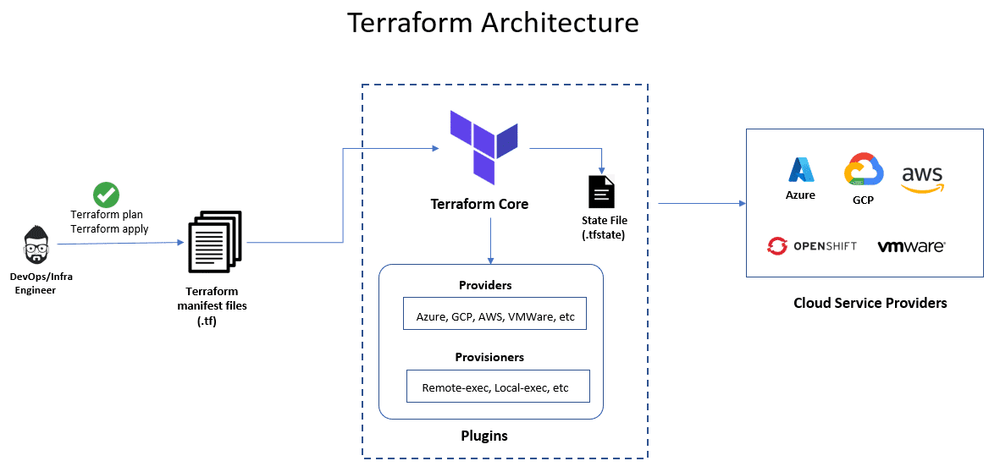

# Day 3

## Lab - User-defined golang functions
Create a file named functions.go with the below content
```
package main

import "fmt"

func yetAnotherFunction() {
	fmt.Println("Yet Another Function invoked")
}

func main() {
   fmt.Println( sayHello("Golang") ) 
   fmt.Println( sayHello("World") ) 
   yetAnotherFunction()
}

// This function accepts a string input and returns a string output
func sayHello( msg string ) string {
  return "Hello, " + msg + " !"
}


/* function overloading is not supported by golang
func sayHello( ) string {
  return "Hello World !"
}
*/
```

Run it
```
go run ./functions.go
```

Expected output


## Lab - Function with multiple returns
function-with-multiple-returns.go
```
package main

import "fmt"

func myFunction() (int,int) {
  return 10, 20
}

func main() {
   x, y := myFunction() // := is a short form of declaring a new variable and initializing some value 

   fmt.Println ( "Value of x is ", x )
   fmt.Println ( "Value of y is ", y )
}
```

Run it
```
go run ./functions-with-multiple-returns.go
```

Expected output


## Lab - Golang loops

loops.go
```
ackage main

import "fmt"

func main() {

	count := 5 //Declares a count variant of type int and assigns a value 5

	for count > 0 {
	   fmt.Println("Before decrementing ", count)

	   count-- //equivalent to count = count - 1

	   fmt.Println("After decrementing ", count)

	   //--count pre-decrement is not supported in golang unlike C++
	   //++count pre-increment is not supported in golang unlike C++
	   //count++ is supported in golang
	}
	fmt.Println("Value of count is", count, " after for loop")

	count = 0 //Variable is already declared, in this line we are just resetting the count value to 0

	for count=1; count<10; count++ {
	   fmt.Println( count )
	}
}
```

Run it
```
go run ./loops.go
```
Expected output


## Lab - Golang map

maps.go
```
package main

import "fmt"

func main() {

	toolsPath := map[string]string {
           "java_home": "/usr/lib/jdk11",
	   "mvn_home" : "/usr/share/maven",
	}

	fmt.Println("Java Home Directory :", toolsPath["java_home"])

	//add a key,value pair into an existing map
	toolsPath["go_home"] = "/usr/go"

	//iterating a map and printing its values
	for key,value := range toolsPath {
		fmt.Println(key,value)
	}

	//delete a key-value pair from an existing map
	delete(toolsPath, "go_home")
	fmt.Println(toolsPath)
}
```

Run it
```
go run ./maps.go
```

Expected output


## Lab - Golang pointers
pointers.go
```
package main

import "fmt"

func sayHello( msgPtr *string ) {

	//Dereferencing - the values stored at address pointed by msgPtrl will be printed here
	fmt.Println("Inside sayHello function ", *msgPtr )
	fmt.Println("Address pointed by msgPtr is ", msgPtr ) //Here the address pointed by pointer will be printed
	fmt.Println("Address pointed by msgPtr is ", &msgPtr ) //Prints the address of msgPtr

	tmp := *msgPtr //The value stored at the address pointed by msgPtr is assigned to tmp string

	*msgPtr = tmp + " Golang" + " !"

	fmt.Println("Inside sayHello before return ", *msgPtr)

}

func main() {
   //msg is a string variable assigned with value "Hello"
   msg := "Hello"

   fmt.Println("Message before calling sayHello function is ", msg)
   fmt.Println("Address of msg string is ", &msg)

   //sayHello function is taking the address of msg string
   sayHello( &msg )

   fmt.Println("Message after calling sayHello function is ", msg )
}
```

Run it
```
go run ./pointers.go
```

Expected output


## Lab - golang struct with methods
struct.go
```
package main

import "fmt"

type Rectangle struct {
   length int
   width  int
}

//golang Method of struct Rectangle
func (rect Rectangle) Area() int {
    area := rect.length * rect.width
    return area
}

func (rect Rectangle) GetLength() int {
	return rect.length
}

func (rect Rectangle) GetWidth() int {
	return rect.width
}

func main() {
   rectangle := Rectangle {
      length: 100,
      width : 200, 
   }

   fmt.Printf("Length of rectangle : %d\n", rectangle.GetLength())
   fmt.Printf("Width of rectangle  : %d\n", rectangle.GetWidth())
   fmt.Printf("Area of rectangle   : %d\n", rectangle.Area())
}
```

Run it
```
go run ./struct.go
```

Expected output


## Lab - Golang switch case
```
package main

import "fmt"

func main() {

	var direction string

	fmt.Print("Possible values are east,west,south,north")

	fmt.Print("Enter some direction :")
	fmt.Scanln(&direction)

	switch direction {
	case "east":
		fmt.Println("You entered direction ", direction)
	case "west":
		fmt.Println("You entered direction ", direction)
	case "south":
		fmt.Println("You entered direction ", direction)
	case "north":
		fmt.Println("You entered direction ", direction)
	default:
		fmt.Println("Invalid direction", "possible values are east, west, north, south")
	}
}
```

Run it
```
go run ./switch-case.go
```

Expected output


## Lab - Golang slice
slice.go
```
package main

import "fmt"

func main() {
	//Declares an int arry of size 6 elements
//	                 0  1  2  3  4  5
	intArray := [6]int{10,20,30,40,50,60}

	fmt.Println("Array elements are ...")
	fmt.Println(intArray)

	//Points to {30,40,50}
	var mySlice []int = intArray[2:5] //2 is the lower bound index, while 5 is the upper bound index, index 5 is not included

	fmt.Println("Slice elements are ...")
	fmt.Println(mySlice)

	//Let's modify the slice at certain indices
	//When the slice is modified, it will also affect the original array that is pointed by the slice
	mySlice[0] = 100 //mySlice[0] is nothing but intArray[2]
	mySlice[1] = 200 //mySlice[1] is nothing but intArray[3]
	mySlice[2] = 300 //mySlice[2] is nothing but intArray[4]

	fmt.Println("Slice elements after modifying slice are ...")
	fmt.Println(mySlice)

	fmt.Println("Array elements after modifying slice are ...")
	fmt.Println(intArray)

	mySlice = append(mySlice,400) 

	fmt.Println("Array elements after appending slice are ...")
	fmt.Println(intArray)

	mySlice = append(mySlice,500) //after append, mySlice is no more associated/pointed to intArray

	fmt.Println("Slice elements after modifying slice are ...")
	fmt.Println(mySlice)

	fmt.Println("Array elements after modifying slice are ...")
	fmt.Println(intArray)
}
```

Run it
```
go run ./slice.go
```

Expected output


## Lab - Creating Custom Golang modules

Let's create three modules namely main, addition and subtraction
```
cd ~
mkdir custom-go-module
cd custom-go-module
mkdir addition subtraction
```

Let's create a module name addition
```
cd ~/custom-go-module/addition
go mod init addition //Creates a file called go.mod with the name of the module and go language version supported
```

Under the addition folder, let's create a file called add.go with the below content
```
package addition

func Add( x float32, y float32 ) float64 {
  return float64( x + y )
}
```

Under the subtraction folder, let's create 
```
cd ~/custom-go-module/subtraction
go mod init subtraction //Creates a file name go.mod with the name of the module and go language version supported
```

Under the subtraction folder, let's create a file named subtract.go with the below content
```
package subtraction

func Subtract( x float32, y float32 ) float64 {
	return float64(x-y)
}
```

Let's create the main module
```
cd ~/custom-go-module
go mod init main
```

Let's create a file named main.go with the below code
```
package main

import (
  "fmt"
  "addition"
  "subtraction"
)

func main() {

	//x := 100.123 By default, golang will assume 100.123 as float64, hence we will get compilation error
	//y := 200.456 By default, golang will assume 200.456 as float64, hence we will get compilation error

	x := float32(100.123) // We are casting/converting float64 into float32
	y := float32(200.456) // We are casting/converting float64 into float32

	fmt.Println ( "The sum of", x, " and ", y, " is ", addition.Add( x, y ) )
	fmt.Println ( "The difference of", x, " and ", y, " is ", subtraction.Subtract( x, y ) )

}
```

Run it
```
cd ~/custom-go-module
go mod edit --replace addition=./addition  //This helps golang to locate the addition module
go mod edit --replace subtraction=./subtraction  //This helps golang to locate the subtraction module
go mod tidy //This will download all the dependent modules

go run ./main.go
```

Expected output


In case you support multiple version of your custom module, you could create a subfolder for addition
```
cd ~/custom-go-module/addition
mkdir v2
cp * v2
```
Make sure you update the go.mod file under addition/v2 as shown below
```
module addition/v2

go 1.24.2
```
Make sure the main.go under ~/custom-go-module folder looks like shown below
```
package main

import (
  "fmt"
  "addition/v2"
  "subtraction"
)

func main() {

	//x := 100.123 By default, golang will assume 100.123 as float64, hence we will get compilation error
	//y := 200.456 By default, golang will assume 200.456 as float64, hence we will get compilation error

	x := float32(100.123) // We are casting/converting float64 into float32
	y := float32(200.456) // We are casting/converting float64 into float32

	fmt.Println ( "The sum of", x, " and ", y, " is ", addition.Add( x, y ) )
	fmt.Println ( "The difference of", x, " and ", y, " is ", subtraction.Subtract( x, y ) )

}
```

Run it
```
cd ~/custom-go-module
go mod edit --replace addition/v2=./addition/v2
go mod tidy
go run ./main.go
```

Expected output


## Lab - Golang concurrency
concurrency.go
```
package main

import (
  "fmt"
  "time"
)

func firstFunction( count int ) {
   for i := 0; i < count; i++ {
      fmt.Println("First function ", i )
      time.Sleep(time.Millisecond * 5)
   }
}

func secondFunction( count int ) {
   for i := 0; i < count; i++ {
      fmt.Println("Second function ", i )
      time.Sleep(time.Millisecond * 5)
   }
}

func main() {
	fmt.Println ("Press any key to exit ...")

	//Invoking firstFunction and secondFunction in sequence one after the other
	firstFunction(10)
	secondFunction(10)

	//We wish to run both firstFunction and secondFunction in parallel ( at the same time )
	go firstFunction(1000)
	go secondFunction(1000)

	var tmp string
	fmt.Scanln(&tmp) // this will make sure the program waits until some key is pressed to exit
}
```

Run it
```
go run ./concurrency.go
```

Expected output


## Terraform Overview
<pre>
- is a Infrastructure as a code tool
- it is used to automate provisioning containers, pull container images, virtual machines locally or on public/private/hybrid clouds, etc
- it can also be used to provision storage locally(in your private datacenter) , or in public/private/hybrid cloud
- it can help provisioning virtual machines using virtualbox, vmware, vsphere, etc.
- Terraform is cloud newtral, it works pretty much in any environment and all the private, public and hybrid clouds
- Alterates to Terraform
  - AWS cloudformation
    - disadvantage - can be used only to automate infracture within AWS public cloud and no other environment is supported
- is developed in golang by a company called HashiCorp
- the Domain Specific Language(DSL) i.e the language in which the automation code is written is called HCL
- Terraform uses HCL(HashiCorp Configuration Language) as the DSL to auto infrastructure declaratively
- it comes in two flavours
  1. Terraform Core - open source and supports only command line
  2. Terraform Enterprise - requires license and supports Web Interface, world-wide support is provided by Hashicorp
</pre>

## Info - Terraform High-Level Architecture

